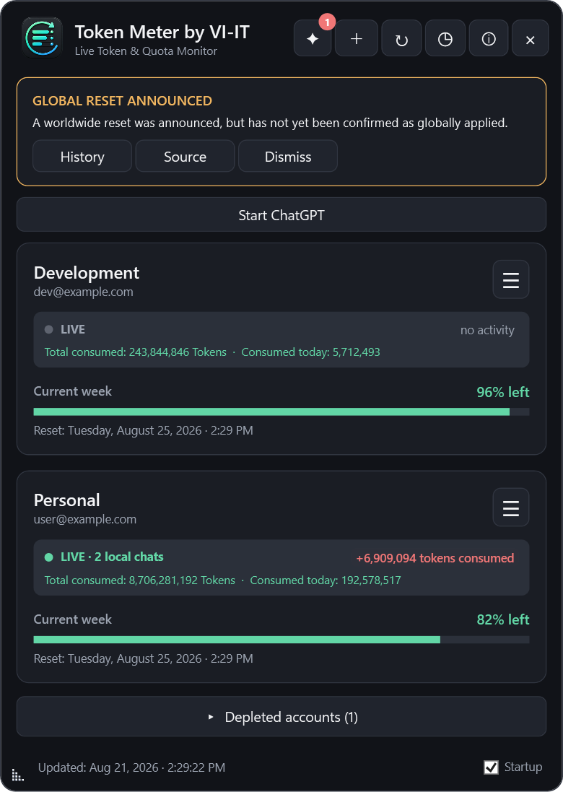
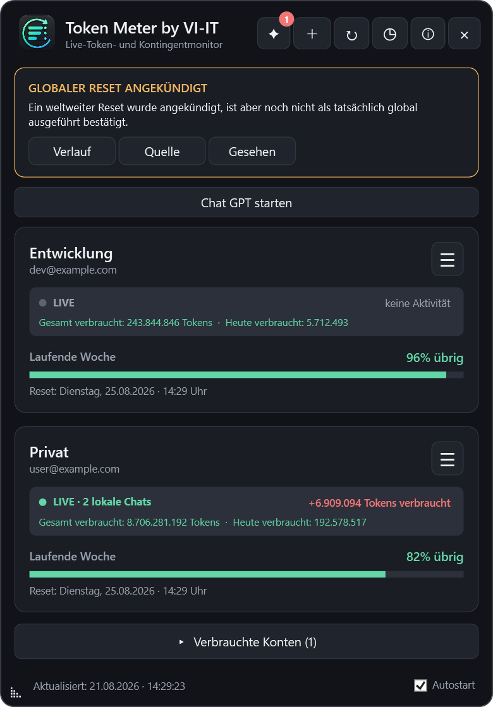

# Token Meter by VI-IT

**Global Codex reset alerts, weekly quota and live token monitoring for multiple ChatGPT accounts on Windows.**

[English](#english) · **[Deutsche Anleitung](#deutsch)** · [Download](https://github.com/VI-IT/Token-Meter/releases/latest) · [Privacy](PRIVACY.md) · [Support](SUPPORT.md)

| Support development |
| --- |
| [ **Ko-fi**](https://ko-fi.com/viitde) &nbsp;&nbsp; [ **PayPal**](https://paypal.me/viitde) |

---

## English

Token Meter by VI-IT alerts Windows users when a newly reported global Codex usage reset appears in the public Codex Reset Timeline. The compact desktop widget also monitors remaining weekly quota, exact reset times, account token totals and live Codex activity across multiple ChatGPT accounts.

### Download for Windows

**[Download the latest installer](https://github.com/VI-IT/Token-Meter/releases/latest/download/Token-Meter-by-VI-IT-Setup.exe)**

- Windows 10 or Windows 11, 64-bit
- Self-contained installer; no separate .NET runtime required
- Future releases can be installed automatically at startup

> The installer is currently not Authenticode-signed. Windows SmartScreen may therefore display an unknown-publisher warning. Only download releases from this repository and verify the published SHA-256 checksum.

### Main feature: global Codex reset alerts

Token Meter checks the public Codex Reset Timeline directly every two minutes. New events are classified as announced, detected for one account, globally confirmed or not globally confirmed. Important notices remain visible inside the app until you acknowledge them, while the reset-history view preserves the timeline. Windows tray notifications are an additional signal rather than the only place where a reset is shown. No VI-IT server, user registration or paid API is required.

### Features

- Receive automatic Windows alerts for newly reported global Codex usage resets
- See unread official ChatGPT and Codex changelog entries from the last seven days in a red header badge
- Open a centered in-app changelog view; opening it marks the currently shown OpenAI entries as read
- Always show the original English OpenAI changelog and, on German Windows, offer a separate **Translate** button on every entry
- Translate only the entry selected by the user through Google Translate and cache that German result locally
- Keep reset notices visible in the app until they are acknowledged
- Review a persistent reset history with announced, account-detected, globally confirmed and rejected states
- Detect a fresh seven-day quota window even when the first observed value is already 95–99%
- Monitor multiple separately authenticated ChatGPT/OpenAI accounts
- Compare remaining Codex weekly quota and exact reset time
- See token totals and consumption changes reported for each account
- See a separate OpenAI credit balance when the account service actually reports one
- See estimated tokens, credits or USD cost for currently active sessions when OpenAI enables the new Codex 0.148 thread-usage data for that workspace
- See the current daily value from the account service, with a clearly marked local minimum while that value is delayed
- See how many Codex chats are actively processing on this Windows PC, inside the matched account card whenever the account can be identified safely
- Detect ChatGPT desktop account or workspace switches on the next LIVE refresh, discard the old assignment and never keep activity attached to the previous account
- Automatically rank accounts with the most remaining capacity first
- Keep depleted accounts collapsed until you need them
- Receive a one-time Windows notification on the exact 11% → 10% transition
- Receive one-time notifications for regular resets within 24 hours and detected quota refills
- Rename accounts locally and reopen the official sign-in flow when needed
- Use German automatically on German Windows; English on all other Windows display languages
- Run in the Windows notification area and optionally start with Windows
- Click an account card to open a movable compact quota monitor
- Minimize the compact monitor to a clean native Windows taskbar progress indicator
- Flash the compact monitor briefly when the remaining weekly percentage decreases
- Install future GitHub releases automatically at startup while showing download and installation progress
- Wait for Token Meter and its background processes to exit before replacing program files during an update
- Show download percentage and transferred megabytes while an update is being retrieved
- Verify cached installers against GitHub's SHA-256 digest and restart through an independent update worker

### How it works

Each account is authenticated separately through the OpenAI/Codex sign-in flow. Quota and account consumption totals are requested for the linked account. Local LIVE activity is derived from Codex session files on the Windows PC where Token Meter is running.

The header update indicator reads the fixed official OpenAI page at [`learn.chatgpt.com/docs/changelog`](https://learn.chatgpt.com/docs/changelog) when Token Meter starts and every six hours while it is running. It counts previously unseen entries dated within the latest seven calendar days. Opening the view marks only the currently displayed entry IDs as read, so a later OpenAI entry can light the badge again. The most recently retrieved entries and read IDs are cached locally for offline display.

The changelog always opens with the original English OpenAI text. On German installations, each entry has its own **Translate** button. Google Translate is contacted only after that button is selected and receives only the public text of that one entry. The returned German text is cached against a hash of the OpenAI source and reused until the source changes. A failed translation affects only the selected card; its English original remains visible. English installations never contact the translation service. No local AI translation model is bundled.

The current build embeds the official stable Codex 0.148.0 component. Token Meter uses its newer account-usage response to show a separate credit balance whenever OpenAI supplies one. For eligible workspaces, it also requests the optional per-thread token and estimated credit/cost figures for locally active sessions. OpenAI does not return those estimates for every account, so the extra line stays hidden when the data is unavailable; weekly quota and local LIVE monitoring continue normally.

Token Meter reads the current ChatGPT/Codex desktop identity again before every LIVE refresh and places its local chat count and consumption inside the matching account card. When the desktop account or workspace changes, the previous assignment is invalidated immediately and the background identity reader is restarted so a cached old identity cannot remain attached to the former account. Several ChatGPT workspaces can legitimately use the same e-mail address; Token Meter therefore combines the fresh identity with a privacy-preserving one-way in-memory workspace fingerprint and the account's reported usage and reset windows. If the result is still ambiguous, Token Meter uses a separate local row instead of assigning activity to the wrong account.

The account service can publish the current daily-usage bucket later than the lifetime total. Until that bucket arrives, Token Meter shows `Consumed today: not yet reported by OpenAI` or, when matched local Codex activity is available, a clearly marked local minimum. The local minimum covers this PC only; the server value can later include usage from other devices.

The token figure is **total consumption reported for the account**, not a remaining balance. OpenAI reports remaining weekly quota as a percentage plus its reset time, but does not provide a fixed absolute token capacity for that quota window. Token Meter therefore does not invent an inaccurate “tokens remaining” value.

Activity on another PC is **not included in the LIVE chat count**. Usage from another device can later change the account's quota or token total when OpenAI reports an updated value, but Token Meter cannot identify how many chats are currently active on that other device. The underlying OpenAI endpoints and local session formats are not public stable APIs and can change.

When the account token total increases because of activity on another device, Token Meter shows the newly detected token difference in red on the next successful account refresh. OpenAI does not label that difference with a source device, so Token Meter cannot separate PC 1 from PC 2.

Regular weekly reset timestamps can be announced up to 24 hours in advance. Token Meter stores the most recently observed weekly reset timestamp for every account and recognizes a new seven-day window even if activity has already reduced the first visible value from 100% to 95–99%. For extraordinary service-wide resets, Token Meter also reads the public `codex-reset.com` timeline directly every two minutes. Its persistent in-app notice distinguishes an announcement from a reset detected on one account, a globally confirmed reset or an event that public observation did not confirm globally. This optional public signal requires no VI-IT server, account or API key; if it is unavailable, normal quota and LIVE monitoring continue unaffected.

Clicking an account card switches from the full manager to a small always-on-top quota monitor for that account. The monitor can be moved freely, flashes briefly when the remaining weekly percentage decreases and can be minimized to the Windows taskbar. While minimized, Windows shows the remaining quota through its native taskbar progress indicator without a low-resolution text overlay. Double-click the monitor or use its restore button to return to the full manager.

The central ChatGPT button opens the existing official ChatGPT desktop app. OpenAI does not currently provide Token Meter with an official Windows account-handoff interface, so ChatGPT opens with the account that was last active in ChatGPT itself.

### Privacy and security

- No passwords are requested or stored by Token Meter
- Optional technical diagnostics are off by default, require explicit consent and can be changed later in the About window
- Diagnostics contain only app/Windows version information and sanitized crash details; never accounts, email addresses, quotas, token values, prompts or authentication data
- Automatic updates preserve the existing diagnostics choice and never enable it
- The optional news indicator requests the public official OpenAI changelog; only a German user's explicit **Translate** action sends the selected public entry to Google, never Token Meter accounts, token values or authentication data
- Account profiles, authentication material and usage snapshots remain on the local Windows device
- The distributed installer contains no developer accounts, cookies, sessions, caches or access tokens
- Removing an account from Token Meter removes only its local Token Meter profile

Read the complete [privacy information](PRIVACY.md) and [security policy](SECURITY.md).

### Installation

1. Download `Token-Meter-by-VI-IT-Setup.exe` from the latest release.
2. Run the installer for the current Windows user.
3. Start Token Meter and select **+** to add an account.
4. Complete the official OpenAI sign-in in your browser.

When a newer GitHub release is available, Token Meter downloads and installs it automatically when the app starts. It shows the download percentage and transferred megabytes. A complete cached installer is verified against GitHub's SHA-256 digest instead of being downloaded again. An independent temporary update worker waits for Token Meter to exit, runs the installer, waits for completion and explicitly restarts the installed application. Diagnostics are written to `update-worker.log` and `update-install.log` in the temporary Token Meter update folder.

### Support development

[Say thanks via Ko-fi](https://ko-fi.com/viitde) · [Support via PayPal](https://paypal.me/viitde)

Support is voluntary and does not unlock features.

---

## Deutsch

Token Meter by VI-IT benachrichtigt Windows-Nutzer, sobald in der öffentlichen Codex Reset Timeline ein neuer globaler Codex-Kontingentreset gemeldet wird. Das kompakte Desktop-Widget überwacht zusätzlich Wochenkontingent, genaue Reset-Zeiten, kontobezogene Tokenstände und lokale Codex-Liveaktivität für mehrere ChatGPT-Konten.

### Download für Windows

**[Aktuellen Installer herunterladen](https://github.com/VI-IT/Token-Meter/releases/latest/download/Token-Meter-by-VI-IT-Setup.exe)**

- Windows 10 oder Windows 11, 64 Bit
- Vollständiger Installer; keine separate .NET-Laufzeit erforderlich
- Zukünftige Versionen können beim Start automatisch installiert werden

> Der Installer ist derzeit nicht mit einem Authenticode-Zertifikat signiert. Windows SmartScreen kann deshalb einen Hinweis auf einen unbekannten Herausgeber anzeigen. Lade die Datei ausschließlich aus diesem Repository herunter und vergleiche bei Bedarf die veröffentlichte SHA-256-Prüfsumme.

### Hauptfunktion: globale Codex-Reset-Meldungen

Token Meter prüft alle zwei Minuten direkt die öffentliche Codex Reset Timeline. Neue Ereignisse werden als angekündigt, bei einem Konto erkannt, global bestätigt oder nicht global bestätigt eingeordnet. Wichtige Hinweise bleiben im Hauptfenster sichtbar, bis du sie bestätigst; der Reset-Verlauf bewahrt die Ereignisse dauerhaft auf. Windows-Mitteilungen sind nur noch ein zusätzlicher Hinweis. Dafür sind weder ein VI-IT-Server noch eine Benutzerregistrierung oder kostenpflichtige API erforderlich.

### Funktionen

- Automatische Windows-Mitteilungen über neu gemeldete globale Codex-Kontingentresets erhalten
- Ungelesene offizielle ChatGPT- und Codex-Changelog-Einträge der letzten sieben Tage als rote Zahl in der Kopfzeile sehen
- Mittig geöffneten Changelog direkt in Token Meter lesen; beim Öffnen gelten die aktuell angezeigten OpenAI-Einträge als gelesen
- Englischen OpenAI-Originaltext immer direkt anzeigen und unter deutschem Windows pro Eintrag einen eigenen Button **Übersetzen** anbieten
- Ausschließlich den vom Benutzer ausgewählten Eintrag über Google Translate übersetzen und die deutsche Fassung lokal speichern
- Reset-Hinweise im Hauptfenster behalten, bis sie ausdrücklich bestätigt wurden
- Gespeicherten Reset-Verlauf mit angekündigten, kontoabhängig erkannten, global bestätigten und verworfenen Ereignissen öffnen
- Neues Sieben-Tage-Fenster auch dann erkennen, wenn der erste sichtbare Wert bereits bei 95–99 % liegt
- Mehrere getrennt angemeldete ChatGPT-/OpenAI-Konten überwachen
- Verbleibendes Codex-Wochenkontingent und genaue Reset-Zeit vergleichen
- Kontobezogene Tokenstände und Verbrauchsänderungen anzeigen
- Separates OpenAI-Credit-Guthaben anzeigen, sofern der Kontodienst für das Konto tatsächlich eines meldet
- Geschätzte Tokens, Credits oder USD-Kosten aktiver Sitzungen sehen, sofern OpenAI die neue Codex-0.148-Sitzungsauswertung für den jeweiligen Workspace freigibt
- Aktuellen Tageswert des Kontodienstes sehen; bei Verzögerung mit klar gekennzeichnetem lokalen Mindestwert
- In der passenden Kontokarte anzeigen, wie viele Codex-Chats auf diesem Windows-PC gerade verarbeitet werden, sobald das Konto sicher zugeordnet werden kann
- Wechsel des ChatGPT-Desktop-Kontos oder Arbeitsbereichs bei der nächsten LIVE-Aktualisierung erkennen, die alte Zuordnung verwerfen und Aktivität niemals am vorherigen Konto hängen lassen
- Konten mit dem größten verbleibenden Kontingent automatisch nach oben sortieren
- Verbrauchte Konten platzsparend einklappen
- Einmalige Windows-Warnung ausschließlich beim exakten Übergang von 11 % auf 10 %
- Einmalige Mitteilungen bei regulären Resets innerhalb von 24 Stunden und bei erkannten Kontingentauffüllungen
- Konten lokal umbenennen und bei Bedarf die offizielle Browser-Anmeldung erneut öffnen
- Deutsche Oberfläche unter deutschem Windows, sonst automatisch Englisch
- Betrieb im Windows-Infobereich und optionaler Windows-Autostart
- Kontokarte anklicken und einen frei verschiebbaren kompakten Prozentmonitor öffnen
- Kompaktmonitor mit sauberem Windows-Fortschrittsbalken in die Taskleiste minimieren
- Kompaktmonitor bei sinkendem Wochenkontingent kurz aufleuchten lassen
- Zukünftige GitHub-Versionen beim Programmstart automatisch installieren und dabei Download- sowie Installationsfortschritt sichtbar anzeigen
- Vor dem Ersetzen der Programmdateien auf das vollständige Ende von Token Meter und seinen Hintergrundprozessen warten
- Beim Herunterladen eines Updates Prozent und übertragene Megabyte anzeigen
- Zwischengespeicherte Installer anhand der GitHub-SHA-256-Prüfsumme prüfen und über einen unabhängigen Update-Wächter neu starten

### Funktionsweise

Jedes Konto wird getrennt über den OpenAI-/Codex-Anmeldeablauf authentifiziert. Kontingent und kontobezogener Gesamtverbrauch werden für das verknüpfte Konto abgefragt. Die lokale LIVE-Aktivität wird aus Codex-Sitzungsdateien auf genau dem Windows-PC ermittelt, auf dem Token Meter läuft.

Die Neuerungsanzeige in der Kopfzeile liest beim Start und anschließend alle sechs Stunden ausschließlich die feste offizielle OpenAI-Seite [`learn.chatgpt.com/docs/changelog`](https://learn.chatgpt.com/docs/changelog). Gezählt werden bisher ungelesene Einträge aus den letzten sieben Kalendertagen. Beim Öffnen werden nur die gerade angezeigten Eintrags-IDs als gelesen gespeichert; ein späterer neuer OpenAI-Eintrag aktiviert die rote Zahl deshalb erneut. Der zuletzt geladene Stand und die gelesenen IDs bleiben lokal gespeichert, damit das Fenster auch bei einer vorübergehend fehlenden Verbindung Inhalt zeigen kann.

Der Changelog öffnet immer mit dem englischen OpenAI-Originaltext. In der deutschen Oberfläche besitzt jeder Eintrag einen eigenen Button **Übersetzen**. Erst dieser bewusste Klick kontaktiert Google Translate und übermittelt ausschließlich den öffentlichen Text des gewählten Eintrags. Die deutsche Fassung wird über einen Hash dem OpenAI-Quelleintrag zugeordnet und bis zu einer Änderung wiederverwendet. Schlägt eine Übersetzung fehl, betrifft das nur die ausgewählte Karte und ihr englisches Original bleibt sichtbar. Englische Installationen kontaktieren den Übersetzungsdienst nie. Ein lokales KI-Übersetzungsmodell wird nicht mitgeliefert.

Der aktuelle Build enthält die offizielle stabile Codex-Komponente 0.148.0. Token Meter nutzt deren erweiterte Kontoauskunft, um ein separates Credit-Guthaben anzuzeigen, sobald OpenAI dieses liefert. Bei dafür freigeschalteten Workspaces werden zusätzlich die optionalen Token- sowie geschätzten Credit-/Kostenwerte der lokal aktiven Sitzungen abgefragt. OpenAI stellt diese Schätzwerte nicht für jedes Konto bereit; fehlen sie, bleibt die Zusatzzeile ausgeblendet und Wochenkontingent sowie lokale LIVE-Erkennung funktionieren unverändert weiter.

Token Meter liest die aktuelle Identität der ChatGPT-/Codex-Desktop-Sitzung vor jeder LIVE-Aktualisierung erneut und zeigt lokale Chats sowie lokalen Verbrauch in der passenden Kontokarte an. Wechselt das Desktop-Konto oder der Arbeitsbereich, wird die bisherige Zuordnung sofort verworfen und der interne Identitätsleser neu gestartet, damit keine zwischengespeicherte alte Identität am vorherigen Konto hängen bleibt. Mehrere ChatGPT-Arbeitsbereiche können dieselbe E-Mail-Adresse verwenden; deshalb kombiniert Token Meter die frische Identität mit einem datensparsamen, nicht umkehrbaren Arbeitsbereich-Fingerabdruck im Arbeitsspeicher sowie den gemeldeten Verbrauchs- und Reset-Fenstern. Bleibt die Zuordnung mehrdeutig, erscheint eine getrennte lokale Zeile, statt Aktivität einem falschen Konto zuzuweisen.

Der Kontodienst kann den aktuellen Tages-Bucket später bereitstellen als den Gesamtverbrauch. Bis dahin zeigt Token Meter `Heute verbraucht: von OpenAI noch nicht gemeldet` oder – falls zugeordnete lokale Codex-Aktivität vorhanden ist – einen klar gekennzeichneten lokalen Mindestwert. Dieser Mindestwert umfasst nur diesen PC; der spätere Serverwert kann auch Nutzung anderer Geräte enthalten.

Die Tokenzahl ist der **von OpenAI gemeldete Gesamtverbrauch des Kontos**, kein Restguthaben. OpenAI liefert für das Wochenkontingent die verbleibenden Prozent und die Reset-Zeit, aber keine feste absolute Token-Gesamtmenge. Token Meter zeigt deshalb keinen erfundenen und möglicherweise falschen Wert „Tokens übrig“ an.

Aktivität auf einem zweiten PC wird **nicht in der LIVE-Chat-Anzahl mitgezählt**. Deren Verbrauch kann sich später im Kontingent oder Tokenstand bemerkbar machen, sobald OpenAI einen aktualisierten Wert liefert. Token Meter kann jedoch nicht erkennen, wie viele Chats auf dem anderen Gerät gerade aktiv sind. Die zugrunde liegenden OpenAI-Endpunkte und lokalen Sitzungsformate sind keine stabilen öffentlichen APIs und können sich ändern.

Steigt der kontobezogene Tokenstand durch Aktivität auf einem anderen Gerät, zeigt Token Meter die neu erkannte Token-Differenz nach der nächsten erfolgreichen Kontoaktualisierung rot an. OpenAI kennzeichnet diese Differenz nicht mit einem Ursprungsgerät; deshalb kann Token Meter PC 1 und PC 2 dabei nicht auseinanderhalten.

Reguläre Wochenreset-Termine können bis zu 24 Stunden vorher angekündigt werden. Token Meter speichert für jedes Konto den zuletzt beobachteten Wochenreset-Termin und erkennt ein neues Sieben-Tage-Fenster auch dann, wenn Aktivität den ersten sichtbaren Wert bereits von 100 % auf 95–99 % reduziert hat. Bei außergewöhnlichen dienstweiten Resets liest Token Meter zusätzlich alle zwei Minuten direkt die öffentliche Timeline von `codex-reset.com`. Der dauerhafte Hinweis im Hauptfenster unterscheidet eine Ankündigung, einen bei einem Konto erkannten Reset, einen global bestätigten Reset und ein öffentlich nicht global bestätigtes Ereignis. Dieses optionale öffentliche Signal benötigt weder einen VI-IT-Server noch ein Konto oder einen API-Schlüssel; fällt die Timeline aus, laufen Kontingent- und LIVE-Überwachung unverändert weiter.

Ein Klick auf eine Kontokarte wechselt vom vollständigen Manager zu einem kleinen, immer sichtbaren Prozentmonitor für dieses Konto. Der Monitor lässt sich frei verschieben, leuchtet bei sinkendem Wochenkontingent kurz auf und kann in die Windows-Taskleiste minimiert werden. Dort verwendet er den nativen Windows-Fortschrittsbalken ohne schlecht skalierbares Text-Overlay. Per Doppelklick oder Rückkehrtaste öffnet sich wieder der vollständige Manager.

Der zentrale ChatGPT-Button öffnet die bereits installierte offizielle ChatGPT-Desktop-App. OpenAI stellt Token Meter derzeit keine offizielle Windows-Schnittstelle zur Kontoübergabe bereit. Deshalb öffnet ChatGPT mit dem zuletzt innerhalb von ChatGPT aktiven Konto.

### Datenschutz und Sicherheit

- Token Meter fragt keine Passwörter ab und speichert keine Passwörter
- Optionale technische Diagnosedaten sind standardmäßig ausgeschaltet, benötigen eine ausdrückliche Zustimmung und bleiben später im Infofenster änderbar
- Diagnosedaten enthalten nur Programm-/Windows-Versionen und bereinigte Absturzinformationen; niemals Konten, E-Mail-Adressen, Kontingente, Tokenwerte, Eingaben oder Anmeldedaten
- Automatische Updates behalten die vorhandene Diagnoseauswahl bei und aktivieren sie niemals selbstständig
- Die optionale Neuerungsanzeige ruft den öffentlichen offiziellen OpenAI-Changelog ab; erst ein ausdrücklicher Klick auf **Übersetzen** sendet den gewählten öffentlichen Eintrag an Google, niemals Token-Meter-Konten, Tokenwerte oder Anmeldedaten
- Kontoprofile, Authentifizierungsdaten und Nutzungsstände bleiben lokal auf dem Windows-Gerät
- Der veröffentlichte Installer enthält keine Entwicklerkonten, Cookies, Sitzungen, Caches oder Zugriffstoken
- Das Entfernen eines Kontos löscht ausschließlich dessen lokales Token-Meter-Profil

Lies die vollständigen [Datenschutzinformationen](PRIVACY.md) und die [Sicherheitsrichtlinie](SECURITY.md).

### Installation

1. `Token-Meter-by-VI-IT-Setup.exe` aus dem neuesten Release herunterladen.
2. Installer für den aktuellen Windows-Benutzer ausführen.
3. Token Meter starten und über **+** ein Konto hinzufügen.
4. Die offizielle OpenAI-Anmeldung im Browser abschließen.

Wenn ein neueres GitHub-Release verfügbar ist, lädt Token Meter es beim Programmstart automatisch herunter und installiert es. Dabei werden Prozent und übertragene Megabyte angezeigt. Ein vollständiger zwischengespeicherter Installer wird anhand der GitHub-SHA-256-Prüfsumme geprüft und nicht erneut heruntergeladen. Ein unabhängiger temporärer Update-Wächter wartet auf das Programmende, führt den Installer aus, wartet auf dessen Abschluss und startet die installierte Anwendung ausdrücklich neu. Diagnosen stehen als `update-worker.log` und `update-install.log` im temporären Token-Meter-Updateordner.

### Entwicklung unterstützen

[Über Ko-fi Danke sagen](https://ko-fi.com/viitde) · [Mit PayPal unterstützen](https://paypal.me/viitde)

Die Unterstützung ist freiwillig und schaltet keine zusätzlichen Funktionen frei.

---

## Contact / Kontakt

- Website: [www.vi-it.de](https://www.vi-it.de)
- Email: [info@vi-it.de](mailto:info@vi-it.de)
- Issues: [GitHub Issues](https://github.com/VI-IT/Token-Meter/issues)

Token Meter by VI-IT is distributed as closed-source Windows software. Source code is not included in this public release repository.

ChatGPT and Codex are trademarks of OpenAI. Token Meter by VI-IT is independent software and is not affiliated with, sponsored, certified, or endorsed by OpenAI.

ChatGPT und Codex sind Marken von OpenAI. Token Meter by VI-IT ist unabhängige Software und nicht mit OpenAI verbunden, von OpenAI gesponsert, zertifiziert oder empfohlen.
