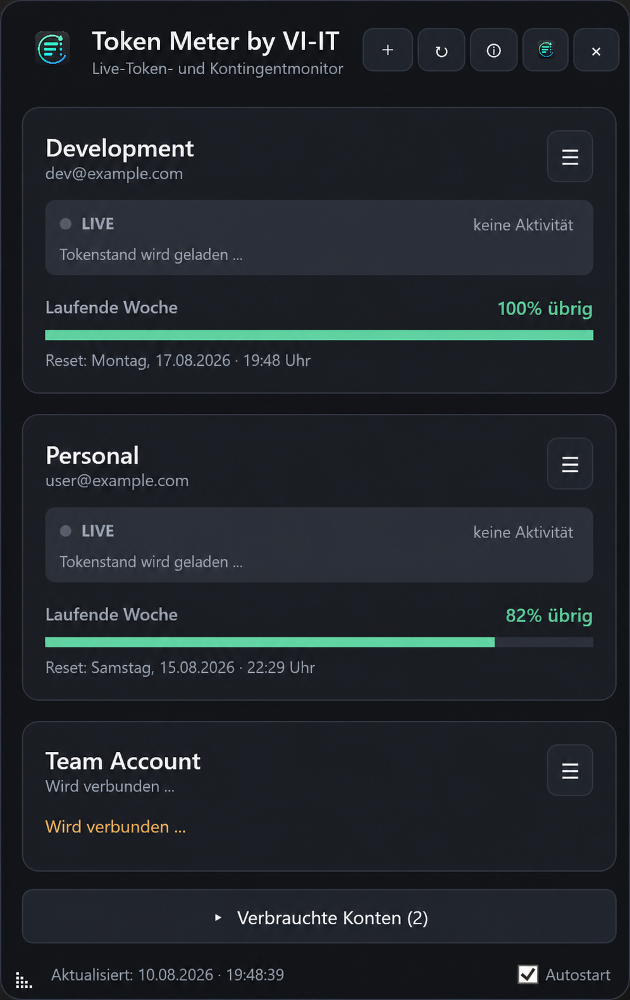
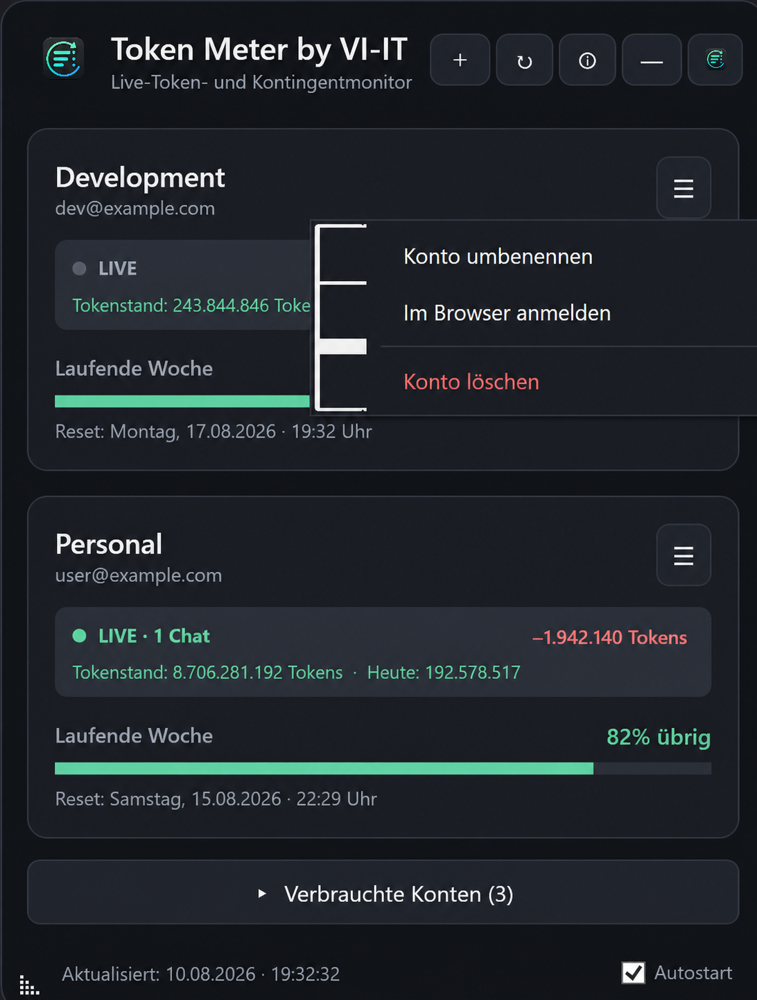

# Token Meter by VI-IT

**Live Codex token usage and quota monitor for multiple ChatGPT accounts on Windows.**

[English](#english) · **[Deutsche Anleitung](#deutsch)** · [Download](https://github.com/VI-IT/Token-Meter/releases/latest) · [Privacy](PRIVACY.md) · [Support](SUPPORT.md)

---

## English

Token Meter by VI-IT is a compact Windows desktop widget for monitoring OpenAI Codex usage across multiple ChatGPT accounts. It shows remaining weekly quota, reset date and time, local live token activity, active Codex chat count, and token consumption without repeatedly opening account pages.

### Download for Windows

**[Download the latest installer](https://github.com/VI-IT/Token-Meter/releases/latest/download/Token-Meter-by-VI-IT-Setup.exe)**

- Windows 10 or Windows 11, 64-bit
- Self-contained installer; no separate .NET runtime required
- Version 1.0.4 introduces silent automatic updates for future releases

> The installer is currently not Authenticode-signed. Windows SmartScreen may therefore display an unknown-publisher warning. Only download releases from this repository and verify the published SHA-256 checksum.

### Features

- Monitor multiple separately authenticated ChatGPT/OpenAI accounts
- Compare remaining Codex weekly quota and exact reset time
- See local live token totals, consumption deltas and active Codex chat count
- Automatically rank accounts with the most remaining capacity first
- Keep depleted accounts collapsed until you need them
- Receive a one-time Windows notification on the exact 11% → 10% transition
- Rename accounts locally and reopen the official sign-in flow when needed
- Use German automatically on German Windows; English on all other Windows display languages
- Run in the Windows notification area and optionally start with Windows
- Install future GitHub releases automatically and silently at startup

### How it works

Each account is authenticated separately through the OpenAI/Codex sign-in flow. Token Meter reads best-effort quota information and local Codex session activity, then presents it in one compact window. The underlying OpenAI endpoints and local session formats are not public stable APIs and can change.

The central ChatGPT button opens the existing official ChatGPT desktop app. OpenAI does not currently provide Token Meter with an official Windows account-handoff interface, so ChatGPT opens with the account that was last active in ChatGPT itself.

### Privacy and security

- No passwords are requested or stored by Token Meter
- No analytics, advertising or VI-IT cloud service is used
- Account profiles, authentication material and usage snapshots remain on the local Windows device
- The distributed installer contains no developer accounts, cookies, sessions, caches or access tokens
- Removing an account from Token Meter removes only its local Token Meter profile

Read the complete [privacy information](PRIVACY.md) and [security policy](SECURITY.md).

### Installation

1. Download `Token-Meter-by-VI-IT-Setup.exe` from the latest release.
2. Run the installer for the current Windows user.
3. Start Token Meter and select **+** to add an account.
4. Complete the official OpenAI sign-in in your browser.

Version 1.0.3 and older must be upgraded to 1.0.4 once manually. Starting with 1.0.4, later releases are downloaded and installed automatically when Token Meter starts.

### Support development

[Say thanks via Ko-fi](https://ko-fi.com/viitde) · [Support via PayPal](https://paypal.me/viitde)

Support is voluntary and does not unlock features.

---

## Deutsch

Token Meter by VI-IT ist ein kompaktes Windows-Desktop-Widget zur Überwachung der OpenAI-Codex-Nutzung mehrerer ChatGPT-Konten. Es zeigt das verbleibende Wochenkontingent, Datum und Uhrzeit des Resets, lokale Live-Tokenaktivität, die Anzahl aktiver Codex-Chats und den Tokenverbrauch an.

### Download für Windows

**[Aktuellen Installer herunterladen](https://github.com/VI-IT/Token-Meter/releases/latest/download/Token-Meter-by-VI-IT-Setup.exe)**

- Windows 10 oder Windows 11, 64 Bit
- Vollständiger Installer; keine separate .NET-Laufzeit erforderlich
- Version 1.0.4 führt stille automatische Updates für zukünftige Versionen ein

> Der Installer ist derzeit nicht mit einem Authenticode-Zertifikat signiert. Windows SmartScreen kann deshalb einen Hinweis auf einen unbekannten Herausgeber anzeigen. Lade die Datei ausschließlich aus diesem Repository herunter und vergleiche bei Bedarf die veröffentlichte SHA-256-Prüfsumme.

### Funktionen

- Mehrere getrennt angemeldete ChatGPT-/OpenAI-Konten überwachen
- Verbleibendes Codex-Wochenkontingent und genaue Reset-Zeit vergleichen
- Lokalen Live-Tokenstand, Verbrauchsänderungen und aktive Codex-Chats anzeigen
- Konten mit dem größten verbleibenden Kontingent automatisch nach oben sortieren
- Verbrauchte Konten platzsparend einklappen
- Einmalige Windows-Warnung ausschließlich beim exakten Übergang von 11 % auf 10 %
- Konten lokal umbenennen und bei Bedarf die offizielle Browser-Anmeldung erneut öffnen
- Deutsche Oberfläche unter deutschem Windows, sonst automatisch Englisch
- Betrieb im Windows-Infobereich und optionaler Windows-Autostart
- Zukünftige GitHub-Versionen beim Programmstart automatisch und still installieren

### Funktionsweise

Jedes Konto wird getrennt über den OpenAI-/Codex-Anmeldeablauf authentifiziert. Token Meter liest die bestmöglich verfügbaren Kontingentinformationen und lokale Codex-Sitzungsaktivität und stellt sie gemeinsam dar. Die zugrunde liegenden OpenAI-Endpunkte und lokalen Sitzungsformate sind keine stabilen öffentlichen APIs und können sich ändern.

Der zentrale ChatGPT-Button öffnet die bereits installierte offizielle ChatGPT-Desktop-App. OpenAI stellt Token Meter derzeit keine offizielle Windows-Schnittstelle zur Kontoübergabe bereit. Deshalb öffnet ChatGPT mit dem zuletzt innerhalb von ChatGPT aktiven Konto.

### Datenschutz und Sicherheit

- Token Meter fragt keine Passwörter ab und speichert keine Passwörter
- Keine Analysefunktionen, Werbung oder VI-IT-Cloud
- Kontoprofile, Authentifizierungsdaten und Nutzungsstände bleiben lokal auf dem Windows-Gerät
- Der veröffentlichte Installer enthält keine Entwicklerkonten, Cookies, Sitzungen, Caches oder Zugriffstoken
- Das Entfernen eines Kontos löscht ausschließlich dessen lokales Token-Meter-Profil

Lies die vollständigen [Datenschutzinformationen](PRIVACY.md) und die [Sicherheitsrichtlinie](SECURITY.md).

### Installation

1. `Token-Meter-by-VI-IT-Setup.exe` aus dem neuesten Release herunterladen.
2. Installer für den aktuellen Windows-Benutzer ausführen.
3. Token Meter starten und über **+** ein Konto hinzufügen.
4. Die offizielle OpenAI-Anmeldung im Browser abschließen.

Version 1.0.3 und älter muss einmal manuell auf 1.0.4 aktualisiert werden. Ab Version 1.0.4 werden spätere Releases beim Start automatisch heruntergeladen und installiert.

### Entwicklung unterstützen

[Über Ko-fi Danke sagen](https://ko-fi.com/viitde) · [Mit PayPal unterstützen](https://paypal.me/viitde)

Die Unterstützung ist freiwillig und schaltet keine zusätzlichen Funktionen frei.

---

## Contact / Kontakt

- Website: [www.vi-it.de](https://www.vi-it.de)
- Email: [info@vi-it.de](mailto:info@vi-it.de)
- Issues: [GitHub Issues](https://github.com/VI-IT/Token-Meter/issues)

Token Meter by VI-IT is distributed as closed-source Windows software. Source code is not included in this public release repository.

ChatGPT and Codex are trademarks of OpenAI. Token Meter by VI-IT is independent software and is not affiliated with, sponsored, certified, or endorsed by OpenAI.

ChatGPT und Codex sind Marken von OpenAI. Token Meter by VI-IT ist unabhängige Software und nicht mit OpenAI verbunden, von OpenAI gesponsert, zertifiziert oder empfohlen.
